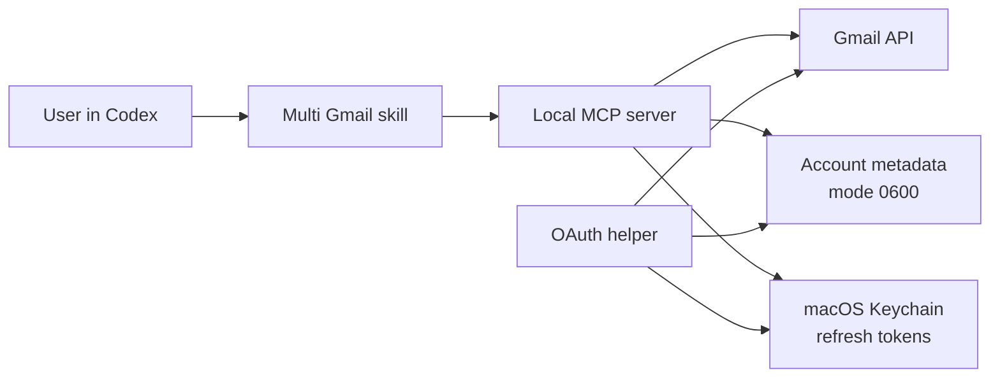

# Architecture

Multi Gmail is deliberately small: one local Codex plugin, one stdio MCP server, and one local authorization helper.

## Components

### Plugin manifest

`.codex-plugin/plugin.json` declares the bundled skill and MCP server. `.mcp.json` launches the committed `dist/server.mjs` bundle over local stdio.

### Skill

`skills/multi-gmail/SKILL.md` teaches Codex the account-selection and safety rules. It does not contain credentials or execute Gmail requests itself.

### MCP server

`src/server.ts` validates tool inputs, separates read and write operations, and returns structured per-account results. `src/gmail-api.ts` is the only Gmail API boundary.

### Authorization helper

`src/auth.ts` runs a loopback OAuth flow using a random state value and PKCE. It verifies the authorized email with Google's OpenID userinfo endpoint before saving the account.

### Local storage

`src/storage.ts` stores account metadata and OAuth client configuration under the user's application-support directory with restrictive permissions. Refresh tokens are read from macOS Keychain only when needed.

## Account invariants

- Read operations accept one email/alias or `all`.
- Write operations accept exactly one explicit email/alias.
- Account aliases must be unique.
- Each result includes the source account.
- A failed account remains visible as an error; it is never silently converted to an empty result.

## Build and distribution

TypeScript is bundled into two dependency-contained ESM entry points:

- `dist/server.mjs` for Codex;
- `dist/auth.mjs` for OAuth setup.

The built files are committed so installers do not need to run `npm install`. CI rebuilds them and fails if the committed bundle is stale.
